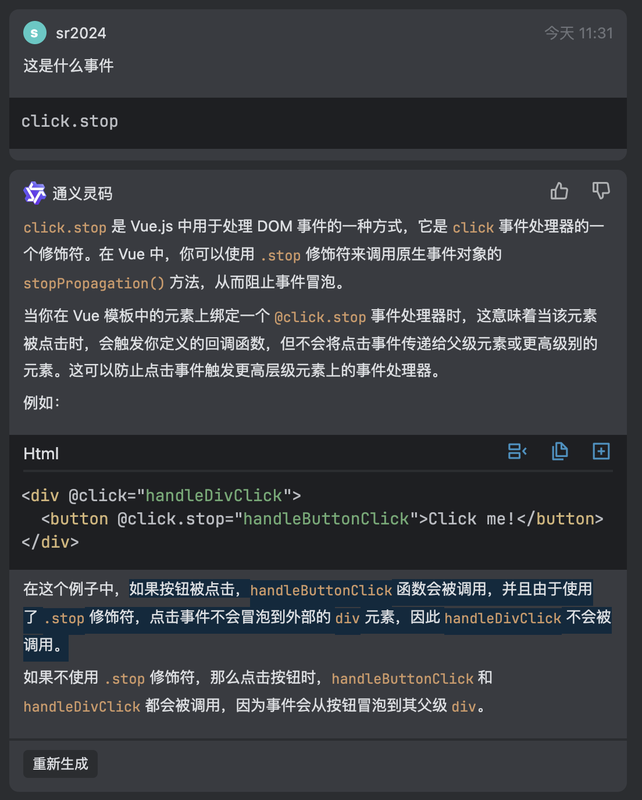
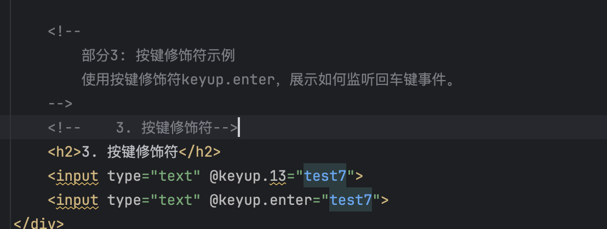
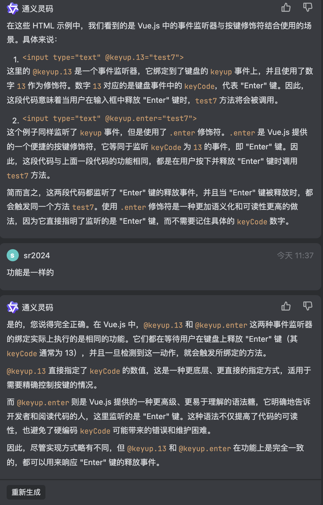

# helloworld

## mvvm

Vue.js 的 MVVM (Model-View-ViewModel) 架构模式实现是指 Vue 如何管理和更新用户界面和数据模型之间的关系。在 Vue 中，MVVM 的关键特性是数据驱动的响应式用户界面，这意味着任何数据模型的改变都会自动反映在用户界面上，而无需显式调用 DOM 更新操作。

下面是 Vue 的 MVVM 实现的关键组成部分：

1. Model（模型）:
   * Model 层代表应用程序的数据层，包含业务逻辑和数据结构。
   * 在 Vue 中，Model 通常是 data 对象中的属性，它们可以在 Vue 实例中定义。
2. View（视图）:
   * View 层是用户看到并与之交互的界面。
   * 在 Vue 中，View 是由模板语法和 HTML 结构组成的，它可以通过双大括号 {{ }} 插值表达式或 v-bind 指令绑定到 Model 数据。
3. ViewModel（视图模型）:
   * ViewModel 是 MVVM 模式中的核心，它作为 Model 和 View 之间的桥梁。
   * 在 Vue 中，ViewModel 是 Vue 实例本身，它负责监听 Model 的变化并更新 View，同时也监听 View 的事件并更新 Model。
   * ViewModel 使用数据观察者（Observer）和编译器（Compile）来实现数据的响应式和视图的更新。

Vue 的 MVVM 实现机制如下：
1. 数据响应化:
   * Vue 使用数据劫持结合发布/订阅模式的方式，通过 Object.defineProperty() 方法将数据对象的每个属性转换为 getter/setter，这样就可以追踪到属性的访问和修改。
2. 指令系统:
   * Vue 提供了一系列的指令（如 v-model, v-if, v-for 等），用于在模板中操作 DOM 和绑定数据。
3. 观察者（Watcher）:
   * Watcher 负责收集依赖，并在依赖的数据变化时执行更新操作。每当数据变化时，Watcher 就会被通知，从而触发视图的更新。
4. 依赖收集（Dependency Collection）:
   * Dep（依赖）对象用于存储 Watcher，当数据变化时，Dep 会通知所有订阅的 Watcher 去更新视图。
  
通过这种方式，Vue 的 MVVM 实现允许开发者以声明式的方式来编写用户界面，简化了状态管理和 DOM 操作，提高了开发效率和代码可维护性。

# 模板语法

1. 模板的理解:
    * 动态的html页面
    * 包含了一些JS语法代码，如大括号表达式和指令(以v-开头的自定义标签属性)

2. 双大括号表达式:
    * 语法: {{exp}} 或 {{{exp}}}
    * 功能: 向页面输出数据
    * 可以调用对象的方法

3. 指令一: 强制数据绑定:
    * 功能: 指定变化的属性值
    * 完整写法: v-bind:xxx='yyy'
    * 简洁写法: :xxx='yyy'

4. 指令二: 绑定事件监听:
    *  功能: 绑定指定事件名的回调函数
    *  完整写法: v-on:click='xxx'
    *  简洁写法: @click='xxx'

在页面中，通过Vue.js实例化一个名为app的div元素，其中使用了双大括号表达式和两个指令。双大括号表达式用于向页面输出数据，指令用于绑定属性和事件监听。在JavaScript部分，通过Vue.js框架创建了一个实例，并定义了数据和方法。

# 事件处理

click.stop 事件

监听回车事件

